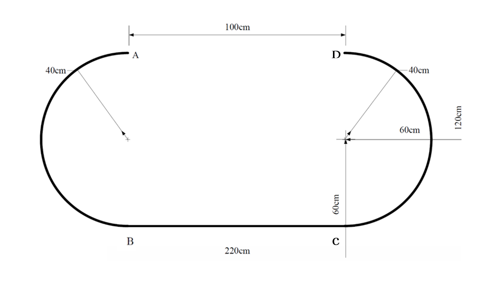

# BalanceCar - 智能平衡车项目

[](https://opensource.org/licenses/MIT) 

本项目是一个基于 **STM32F1系列** 单片机控制的智能平衡车实现，最初设计用于完成重庆交通大学第3届智能小车竞赛的任务。

## ✨ 功能特性

*   **自主移动**: 小车能够在无外界干预下自动行驶。
*   **循迹行驶**: 能够精确跟随指定黑色引导线完成 A->B->C->D 的路径。
*   **断点续行与返程**: 能够跨越赛道中的断点，并从 D 点自动返回起点 A。
*   **自制手柄遥控**: (附加功能) 通过自制手柄控制小车前进、后退和转向。

视频: https://v.douyin.com/8Lta1Wi4GGo/

## 🛠️ 硬件组成

*   **主控单元**: STM32F1系列单片机
*   **传感器**:
    *   12路循迹传感器
    *   MPU6050平衡控制
*   **执行器**:
    *   直流减速电机及驱动模块
*   **遥控部分**:
    *   自制手柄 (包含按键/摇杆, 另一块 STM32F1)
    *   无线通信模块
*   **电源**: 锂电池组及电源管理模块
*   **车体结构**: 自制轮式小车底盘

## 💻 软件与开发环境

*   **编程语言**: C / C++
*   **主要库/框架**: STM32 HAL库
*   **IDE**: Keil MDK, STM32CubeIDE
*   **烧录工具**: ST-Link, J-Link, USB-TTL 等

## 🚀 快速开始

1.  **克隆仓库**:
    ```bash
    git clone https://github.com/your-username/balanceCar.git
    cd balanceCar
    ```
2.  **硬件连接**: 根据代码中的引脚定义连接硬件。如需要可后期开源电路图(请提出issue)
3.  **编译**: 使用相应的 IDE (如 Keil MDK) 打开项目工程文件 (`.uvprojx` 或类似文件)，编译生成 `.hex` 或 `.bin` 文件。
4.  **烧录**: 使用烧录工具将编译好的固件烧录到目标单片机中。
5.  **运行**: 给小车和遥控手柄上电，进行测试。

## 🏁 竞赛背景

本项目的设计遵循了**重庆交通大学电子创新协会第三届智能小车比赛**的规则要求。主要任务包括在指定赛道上完成循迹、跨越断点和返程。

*   **核心要求**:
    *   自主循迹 A->B->C->D。
    *   跨越断点 D->A 返程。
*   **限制**:
    *   尺寸: ≤ 25cm(长)×18cm(宽)×15cm(高)。
    *   轮式小车，禁用履带和麦克纳姆轮。
    *   主控: 仅限 STM32F1 系列。
    *   禁止使用摄像头。
    *   后退距离限制: ≤ 20cm。



## 📄 开源许可证

本项目采用 [MIT License](LICENSE) 开源许可证。